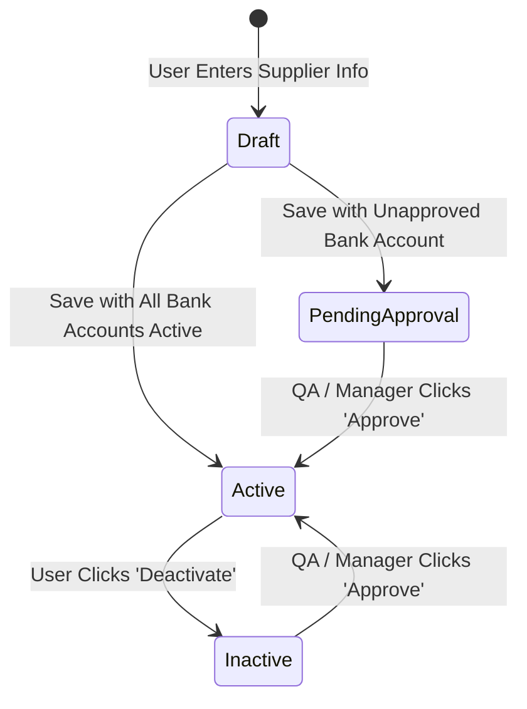

# Functional Specification Document (FSD)
# Module: Supplier Master Setup & Creation (ERP-MD-005)

---

| Document Attribute | Details |
| :--- | :--- |
| **Module Code** | `ERP-MD-005` |
| **Module Name** | Supplier Master Setup & Creation |
| **System / Application** | B&S ERP Enterprise Suite |
| **Document Version** | 1.0.0 |
| **Status** | Approved for Implementation Baseline |
| **Document Author** | Antigravity AI Engineering / Enterprise Architecture |
| **Target Audience** | Business Stakeholders, Product Managers, Frontend/Backend Developers, QA Teams, UX Designers, Business Analysts |

---

## Table of Contents

1. [Objective](#1-objective)
2. [Scope & System Boundaries](#2-scope--system-boundaries)
3. [Supplier Creation – Functional Overview](#3-supplier-creation--functional-overview)
4. [Supplier Lifecycle & Status Transitions](#4-supplier-lifecycle--status-transitions)
5. [Supplier List & Directory Portal](#5-supplier-list--directory-portal)
6. [Supplier Actions Matrix](#6-supplier-actions-matrix)
7. [Supplier Creation & Maintenance Form Structure](#7-supplier-creation--maintenance-form-structure)
8. [Comprehensive Field-Level Specifications](#8-comprehensive-field-level-specifications)
9. [Supplier Identity & Key Sequence Rules](#9-supplier-identity--key-sequence-rules)
10. [Supplier Address Management](#10-supplier-address-management)
11. [Invoice Address Fields & Specifications](#11-invoice-address-fields--specifications)
12. [Supplier Payment Information](#12-supplier-payment-information)
13. [Payment Approval & Governance Workflow](#13-payment-approval--governance-workflow)
14. [Supplier View & Directory Profile](#14-supplier-view--directory-profile)
15. [Supplier Edit & Modification Constraints](#15-supplier-edit--modification-constraints)
16. [Validation Rules Matrix](#16-validation-rules-matrix)
17. [Business Rules Repository](#17-business-rules-repository)
18. [Role-Based Access Control (RBAC) Matrix](#18-role-based-access-control-rbac-matrix)
19. [Role-Based Field-Level Access Control](#19-role-based-field-level-access-control)
20. [End-to-End Approval Workflow](#20-end-to-end-approval-workflow)
21. [Approval History & Governance Log](#21-approval-history--governance-log)
22. [Supplier Status Management Matrix](#22-supplier-status-management-matrix)
23. [Button & Interactive Actions Inventory](#23-button--interactive-actions-inventory)
24. [Table UI Specifications](#24-table-ui-specifications)
25. [Search & Filtering Specifications](#25-search--filtering-specifications)
26. [Auto-Generated Information & Defaults](#26-auto-generated-information--defaults)
27. [System Messages & Alerts Dictionary](#27-system-messages--alerts-dictionary)
28. [Audit Trail & Compliance Logging](#28-audit-trail--compliance-logging)
29. [Supplier Data Dictionary](#29-supplier-data-dictionary)
30. [Functional Requirements Catalog](#30-functional-requirements-catalog)
31. [QA Test Scenarios & Acceptance Criteria (Gherkin Format)](#31-qa-test-scenarios--acceptance-criteria-gherkin-format)
32. [End-to-End Process Flow Diagrams](#32-end-to-end-process-flow-diagrams)
33. [Module & Data Dependencies](#33-module--data-dependencies)
34. [Open Points & Clarifications Required](#34-open-points--clarifications-required)
35. [Prototype vs. FSD Gap Analysis](#35-prototype-vs-fsd-gap-analysis)
36. [Final Quality Verification Checklist](#36-final-quality-verification-checklist)

---

## 1. Objective

This Functional Specification Document (FSD) details the functional, operational, and interface requirements of the **Supplier Master Setup & Creation Module (`ERP-MD-005`)** within the B&S ERP system.

The specification has been **reverse-engineered directly from the approved interactive prototype** implemented in `index.html` and `index.js`. It establishes the authoritative technical and business baseline required by:
* **Business Stakeholders & Product Owners** to validate business workflows, risk scoring, and governance rules.
* **Software Engineers & Developers** to build backend APIs, database schemas, frontend views, state machines, and micro-services.
* **Quality Assurance (QA) Teams** to formulate test plans, automated suites, and regulatory validation matrices.
* **UI/UX Designers** to maintain visual and interaction consistency across master data screens.

---

## 2. Scope & System Boundaries

### In-Scope Functional Areas
* **Supplier Directory Portal (`#panel-sup-list`)**: Search, filtering, KPI monitoring, record approval, activation, deactivation, and editing triggers.
* **Supplier Identity & Primary Attributes (`#panel-sup-form`)**: Supplier ID uniqueness, Name, Operating Company binding, Creation Date.
* **Subtab 1 – General & Contacts (`#panel-sup-subtab-general`)**: Association numbers, tax liabilities, currencies, payment terms, statistic groups, buyer IDs, and dynamic multi-channel contact communication tables.
* **Subtab 2 – Invoice Address Info (`#panel-sup-subtab-invoice-addr`)**: Auto-incremented Address IDs, multi-type selection (`Delivery`, `Invoice`, `Pay`), dynamic chip rendering, per-type default checkboxes, single-default enforcement with auto-replacement, and address line grids.
* **Subtab 3 – Payment Info (`#panel-sup-subtab-payment`)**: Invoicing supplier, payment authorizers, netting, payment blocking, payment method modals, payment address modals (IBAN, Sort Code, Bank Account), role-restricted approval controls, and status sync.
* **Subtab 4 – Licence & Accreditation Controls (`#panel-sup-subtab-licence`)**: Supplier type, Supplier For, Company Registration No & Expiry Date, GDP/GMP Certificate No & Expiry Date, real-time expiry countdowns, risk scoring, questionnaire tracking, technical agreement approvals, and licence status overrides.
* **Subtab 5 – File & Document Attachments (`#panel-sup-subtab-file`)**: Document category classification, file upload integration, document metadata tracking, and file downloads/deletions.
* **Subtab 6 – Dispatch Address Info (`#panel-sup-subtab-dispatch-addr`)**: Dispatch personnel assignment (Responsible Person, Qualified Person, Ship Via), typable dispatch addresses, copy-from-invoice address mechanism, and default dispatch routing.
* **Role-Based Access Control (RBAC)**: Role simulation (`Normal User`, `Manager`, `QA`, `ERP Administrator`), permission gates on approval actions, and UI visibility.
* **State Persistence**: Browser storage (`localStorage` key `erp_suppliers_v1`) maintaining mock master state.

### Out-of-Scope (External System Boundaries)
* Purchasing Order generation and 3-way matching (documented separately in `Purchasing Module`).
* General Ledger posting of Supplier Invoices (documented in `Finance / AP Module`).
* Customer accounts and sales order fulfillment (`Customer Master ERP-MD-004`).

---

## 3. Supplier Creation – Functional Overview

### 3.1 Business Purpose & Objectives
The Supplier Master module serves as the single source of truth for procurement entities, wholesale pharmaceutical vendors, and service contractors. It enforces Good Distribution Practice (GDP) and Good Manufacturing Practice (GMP) compliance, ensures financial settlement accuracy (bank account approval separation of duties), and facilitates multi-site address routing.

### 3.2 Key Roles & Responsibilities
1. **Procurement / Master Data Clerk (`Normal User`)**: Initiates supplier creation, inputs general attributes, enters address details, configures bank accounts, and uploads required documents.
2. **Quality Assurance Officer (`QA`)**: Audits GDP/GMP certificates, verifies company registration, approves supplier records, and authorizes pending payment addresses.
3. **Finance / Operations Manager (`Manager`)**: Reviews credit and netting allowances, approves supplier onboarding, and authorizes supplier payment methods/addresses.
4. **ERP Administrator (`Admin`)**: Full administrative access across all records, bypass capabilities, and system configuration.

### 3.3 High-Level Lifecycle Flow
```
[ Supplier Directory ] ──(Click '➕ Create New Supplier')──► [ Empty Supplier Form Loaded ]
                                                                     │
                                                      ┌──────────────┴──────────────┐
                                                      ▼                             ▼
                                              [ Header Form ]              [ Subtab 1: General ]
                                              (ID, Name, Company)          (Tax, Currency, Contacts)
                                                      │                             │
                                                      ▼                             ▼
                                           [ Subtab 2: Address ]          [ Subtab 3: Payment ]
                                           (Multi-Type, Defaults)        (Methods, Bank Accounts)
                                                      │                             │
                                                      ▼                             ▼
                                           [ Subtab 4: Licence ]          [ Subtab 5: Files ]
                                           (GDP/GMP, Reg Expiries)        (Upload Attachments)
                                                      │                             │
                                                      └──────────────┬──────────────┘
                                                                     ▼
                                                      [ Subtab 6: Dispatch Addr ]
                                                      (RP, QP, Dispatch Addresses)
                                                                     │
                                                      [ Click 'Create Supplier' ]
                                                                     │
                                      ┌──────────────────────────────┴──────────────────────────────┐
                                      ▼                                                             ▼
                        [ All Pay Addrs Active? ]                                      [ Any Pay Addr Pending? ]
                                      │                                                             │
                                      ▼                                                             ▼
                              Status: "Active"                                        Status: "Pending for Approval"
                                      │                                                             │
                                      │                                                   [ QA / Manager Reviews ]
                                      │                                                             │
                                      │                                                   [ Click 'Approve' ]
                                      │                                                             │
                                      └──────────────────────────────┬──────────────────────────────┘
                                                                     ▼
                                                    [ Supplier Active in Directory ]
```

---

## 4. Supplier Lifecycle & Status Transitions

| Current Status | Trigger Event / Action | Actor Role | Next Status | Functional Preconditions & Rules |
| :--- | :--- | :--- | :--- | :--- |
| **New (Unsaved)** | Click `Create Supplier` with all Payment Addresses Active | Normal User, Manager, QA, Admin | **Active** | Supplier ID and Name are valid and unique; licence expiry dates are syntactically valid. |
| **New (Unsaved)** | Click `Create Supplier` with ≥ 1 Payment Address in `Approval Pending` | Normal User, Manager, QA, Admin | **Pending for Approval** | Supplier record saved; list view reflects amber pending badge. |
| **Active** | Click `Deactivate` on Supplier Directory row | Normal User, Manager, QA, Admin | **Inactive** | Supplier status updated to `Inactive`; red badge displayed. |
| **Active** | Update supplier and add new Payment Address in `Approval Pending` | Normal User, Manager, QA, Admin | **Pending for Approval** | Supplier status automatically transitions to `Pending for Approval`. |
| **Pending for Approval** | Click `Approve` on Supplier Directory row | QA, Manager, Admin (or `Simulate Manager Role` active) | **Active** | Supplier status updated to `Active`; all child payment addresses set to `Active`. |
| **Pending for Approval** | Click `Approve` on specific Payment Address row inside Form | QA, Manager, Admin (or `Simulate Manager Role` active) | **Active** (if all child addresses approved) | Individual payment address status set to `Active`. |
| **Inactive** | Click `Approve` on Supplier Directory row | QA, Manager, Admin | **Active** | Re-activates inactive supplier record. |

---

## 5. Supplier List & Directory Portal

### 5.1 Page Purpose & Header
* **Page Title**: `Supplier Master Setup`
* **Page Subtitle**: `Configure supplier details, address profiles, payment terms, licenses, and document attachments.`
* **Active Screen Indicator**: `Active Screen: ERP-MD-005` (`badge badge-success`)
* **Primary Quick Action**: `#btn-create-supplier-quick` (`➕ Create New Supplier`) switches view from Directory to the Form.

### 5.2 Search & Filters
* **Search by Supplier ID (`#sup-search-id`)**: Case-insensitive substring matching against `supplierId`.
* **Search by Supplier Name (`#sup-search-name`)**: Case-insensitive substring matching against `supplierName`.
* **Trigger**: Executed live on input (`input` event).

### 5.3 Supplier Directory Table Specification (`#supplier-list-table`)

| Column Header | Field Source | Data Type | Sortable | Filterable | Alignment | Display Rules / Badge Styling |
| :--- | :--- | :--- | :--- | :--- | :--- | :--- |
| **Supplier ID** | `supplierId` | String | Planned | Yes (Live) | Left | Bold text (e.g., `ACC007`). |
| **Supplier Name** | `supplierName` | String | Planned | Yes (Live) | Left | Standard text (e.g., `ACCENT WIRE TIE`). |
| **Company** | `company` | String | No | No | Left | Company entity code (default: `LAXMI01`). |
| **Supplier Group** | `supplierGroup` | String | No | No | Left | Group classification (e.g., `40 O/H Suppliers`). |
| **Currency** | `currency` | String | No | No | Left | 3-character ISO currency (e.g., `GBP`). |
| **Tax Liability** | `taxLiability` | String | No | No | Left | Tax regime (e.g., `TAX Taxable`). |
| **Supplier Type** | `licenceType` | String | No | No | Left | Regulatory type (e.g., `Non WDA Holder`, `WDA Holder`). |
| **Status** | Calculated / `status` | String | No | No | Center | **Pending for Approval**: Amber badge (`#fef3c7`, text `#b45309`).<br>**Active**: Green badge (`var(--color-success-light)`, text `var(--color-success)`).<br>**Inactive**: Red badge (`var(--color-danger-light)`, text `var(--color-danger)`). |
| **Actions** | Action Buttons | UI Controls | No | No | Center | Contains `Edit`, `Approve`, and `Deactivate` buttons based on role and status. |

---

## 6. Supplier Actions Matrix

| Action Button | Selector | Target Scope | Available Roles | Visibility Condition | Functional Behaviour | Toast / System Result |
| :--- | :--- | :--- | :--- | :--- | :--- | :--- |
| **Create New Supplier** | `#btn-create-supplier-quick` | Global Directory | All Roles | Always visible | Clears all form buffers and switches to Form view. | Switches to `#panel-sup-form`. |
| **Edit Supplier** | `.btn-sup-edit` | Directory Row | All Roles | Always visible | Loads supplier record into Form fields, sets `editingSupplierNo`, sets title to `Supplier Update Form: [Name]`. | Displays badge `Editing` and opens Form. |
| **Approve Supplier** | `.btn-sup-approve` | Directory Row | QA, Manager, Admin | `status === 'Pending for Approval'` OR `status === 'Inactive'` | Updates supplier status to `Active`; activates all child pending payment addresses; persists state. | `Supplier account '[Name]' and payment addresses QA Approved!` (`success`) |
| **Deactivate Supplier**| `.btn-sup-deactivate` | Directory Row | All Roles | `status === 'Active'` | Sets supplier status to `Inactive`; re-renders table; persists state. | `Supplier account '[Name]' deactivated.` (`warning`) |
| **View Directory** | `#btn-sup-view-directory` | Form Header | All Roles | Always visible in Form | Closes form view and returns to Directory table view. | Displays `#panel-sup-list`. |
| **Cancel Form** | `#btn-sup-cancel` | Form Footer | All Roles | Always visible in Form | Discards unsaved edits, resets buffers, and returns to Directory. | Displays `#panel-sup-list`. |
| **Create Supplier** | `#btn-sup-save` | Form Footer | All Roles | Always visible in Form | Validates ID and Name; checks uniqueness; persists new record. | `Supplier '[Name]' created successfully.` (`success`) |
| **Copy Supplier** | `#btn-sup-copy` | Form Footer | All Roles | Always visible in Form | Clears Supplier ID input, clears `editingSupplierNo`, focuses ID input. | `Supplier details copied. Enter a new Supplier ID and click 'Create Supplier'.` (`info`) |
| **Update Supplier** | `#btn-sup-update` | Form Footer | All Roles | Always visible in Form | Validates form; updates existing record matching `editingSupplierNo`; persists state. | `Supplier '[Name]' updated successfully.` (`success`) |

---

## 7. Supplier Creation & Maintenance Form Structure

The Supplier Form (`#panel-sup-form`) is structured into a persistent Header Card and six tabbed panels:

```
┌────────────────────────────────────────────────────────────────────────────────────────┐
│ TOP HEADER CARD (Gradient Navy/Cyan)                                                  │
│ [📊] Supplier Update Form: [Name]                     [Editing Badge] [📋 View Directory]│
│ ┌───────────────────────┬─────────────────────────────┬──────────────────────────────┐ │
│ │ Supplier ID: [ACC007] │ Supplier Name: [ACCENT...]  │ Company: [LAXMI01 ▼]         │ │
│ └───────────────────────┴─────────────────────────────┴──────────────────────────────┘ │
└────────────────────────────────────────────────────────────────────────────────────────┘
┌────────────────────────────────────────────────────────────────────────────────────────┐
│ SUB-TAB BAR: [General] [Invoice Address Info] [Payment Info] [Licence Info] [File Info] [Dispatch Addr]│
└────────────────────────────────────────────────────────────────────────────────────────┘
┌────────────────────────────────────────────────────────────────────────────────────────┐
│ ACTIVE SUB-TAB PANEL CONTENT                                                           │
│ (Dynamic components rendered based on active subtab selection)                          │
└────────────────────────────────────────────────────────────────────────────────────────┘
┌────────────────────────────────────────────────────────────────────────────────────────┐
│ BOTTOM ACTION BAR: [Cancel]               [👤 Create Supplier] [📋 Copy] [⚙ Update]     │
└────────────────────────────────────────────────────────────────────────────────────────┘
```

---

## 8. Comprehensive Field-Level Specifications

### 8.1 Header Form Fields

| Field ID | Label | Input Type | Mandatory | Default Value | Allowed Values / Options | Validation Rules | Description |
| :--- | :--- | :--- | :--- | :--- | :--- | :--- | :--- |
| `sup-form-id` | Supplier ID | Text | **Yes** | `""` | Alphanumeric (e.g. `ACC007`) | Required; unique across supplier register. | Primary key identifier for the supplier. |
| `sup-form-name` | Supplier Name | Text | **Yes** | `""` | Free text string | Required; min 2 chars. | Official trading entity name. |
| `sup-form-company` | Company | Select | **Yes** | `LAXMI01` | `LAXMI01`, `SPECIALS`, `BNS01` | Must select a valid operating company. | ERP operating company entity. |

### 8.2 Subtab 1: General Information Fields

| Field ID | Label | Input Type | Mandatory | Default Value | Allowed Values / Options | Description |
| :--- | :--- | :--- | :--- | :--- | :--- | :--- |
| `sup-gen-assoc-no` | Association No | Text | No | `""` | Free text string | External association / corporate reference. |
| `sup-gen-group` | Supplier Group | Select | **Yes** | `40 O/H Suppliers` | `40 O/H Suppliers`, `10 Trade Suppliers`, `20 Specials Suppliers` | General ledger posting / procurement category. |
| `sup-gen-tax-liability`| Tax Liability | Select | **Yes** | `TAX Taxable` | `TAX Taxable`, `TAX Exempt` | Tax determination status. |
| `sup-gen-identifier-ref`| Identifier Reference | Select | **Yes** | `Yes` | `Yes`, `No` | Master identification flag. |
| `sup-gen-currency` | Currency | Select | **Yes** | `GBP` | `GBP`, `EUR`, `USD` | Base settlement currency. |
| `sup-gen-free-tax-code` | Free Tax Code | Select | No | `Select Free Tax Code` | `Select Free Tax Code`, `Standard Tax` | Free tax exemption code. |
| `sup-gen-creation-date` | Creation Date | Date | **Yes** | `2018-04-17` | Standard ISO date | Date of supplier master initiation. |
| `sup-gen-payment-term` | Payment Term | Select | **Yes** | `0 Due Immediately`| `0 Due Immediately`, `30E 30 Days End of Month`, `14D 14 Days` | Standard invoice payment terms. |
| `sup-gen-tax-code` | Tax Code | Select | **Yes** | `SUK-11 20` | `SUK-11 20` (20% VAT), `ZUK 0` (Zero Rated) | Default VAT/tax code applied on purchase lines. |
| `sup-gen-stat-group` | Statistic Group | Select | **Yes** | `OH Overheads` | `OH Overheads`, `DR Direct Procurement` | Reporting classification. |
| `sup-gen-buyer-id` | Buyer ID | Text | No | `*` | Single character or alphanumeric ID | Responsible procurement agent. |
| `sup-gen-category-code`| Category Code | Text | No | `""` | Free text string | Additional procurement classification. |

### 8.3 Subtab 1: Contact Communication Details Table

| Column / Field | Control Type | Mandatory | Options / Formats | Validation / Behaviour |
| :--- | :--- | :--- | :--- | :--- |
| **Selection Checkbox** | Checkbox (`.chk-sup-contact-row-select`) | No | `true` / `false` | Used for batch row deletion via `#btn-sup-contact-delete-selected`. |
| **Name** | Text (`.sup-contact-name`) | No | String | Contact person's full name. |
| **Description** | Text (`.sup-contact-desc`) | No | String | Role/designation (e.g., `AP Clerk`, `Sales Director`). |
| **Comm Method** | Select (`.sup-contact-method`) | **Yes** | `Phone`, `E-Mail`, `Mobile`, `Fax` | Primary channel of communication. |
| **Value** | Text (`.sup-contact-val`) | **Yes** | Phone number / valid email address | Target contact detail value. |
| **Document Receiver** | Checkbox (`.sup-contact-receiver`) | No | `true` / `false` | Flag indicating whether this contact receives automated ERP docs. |
| **Document Type** | Text (`.sup-contact-doc-type`) | No | String (e.g. `Delivery Note`, `Invoice`, `PO`) | Specific document types dispatched to this recipient. |

### 8.4 Subtab 3: Payment Configuration Fields

| Field ID | Label | Input Type | Mandatory | Default Value | Description |
| :--- | :--- | :--- | :--- | :--- | :--- |
| `sim-manager-role` | Simulate Manager Role | Checkbox | No | `false` | Prototype test control to simulate elevated manager approval rights. |
| `sup-pay-invoicing-supplier`| Invoicing Supplier | Text | No | `""` | Alternate invoicing vendor entity code. |
| `sup-pay-authorizer` | Payment Authorizer | Text | **Yes** | `PRICHA` | Designated finance officer approving AP payments. |
| `sup-pay-invoice-recipient` | Invoice Recipient | Text | **Yes** | `*` | Destination email or department for invoice dispatch. |
| `sup-pay-netting` | Netting Allowed | Checkbox | No | `false` | Enables bilateral AR/AP netting transactions. |
| `sup-pay-blocked` | Blocked For Payment | Checkbox | No | `false` | Hard stop on all automated payment runs for this supplier. |

### 8.5 Subtab 4: Licence & Accreditation Fields

| Field ID | Label | Input Type | Mandatory | Default Value | Allowed Values / Validation | Description |
| :--- | :--- | :--- | :--- | :--- | :--- | :--- |
| `sup-lic-type` | Supplier Type | Select | **Yes** | `Non WDA Holder` | `Non WDA Holder`, `WDA Holder`, `Manufacturer` | Regulatory licence category. |
| `sup-lic-supplier-for` | Supplier For | Select | **Yes** | `Select...` | `Select...`, `Wholesale`, `Services` | Business scope classification. |
| `sup-lic-company-reg` | Company Registration No | Text | No | `""` | Alphanumeric registration number | Companies House registration ID. |
| `sup-lic-company-reg-expiry`| Company Reg Expiry Date | Date | No | `""` | ISO Date; validated against system date | Expiry of business registration certificate. |
| `sup-lic-gdp-gmp-cert-no` | GDP/GMP Certificate No | Text | No | `""` | String (e.g., `UK GDP 48291/001`) | MHRA GDP/GMP verification certificate number. |
| `sup-lic-expiry-date` | GDP/GMP Cert Expiry Date | Date | No | `""` | ISO Date; validated against system date | Expiry of pharmaceutical accreditation licence. |
| `sup-lic-risk-score` | Risk Assessment Score | Select | **Yes** | `Select...` | `Select...`, `Low`, `Medium`, `High` | QA vendor compliance risk score. |
| `sup-lic-questionnaire` | Questionnaire | Checkbox | No | `false` | `true` / `false` | Vendor quality questionnaire return status. |
| `sup-lic-tech-approved-date`| Tech Agreement Approved | Date | No | `""` | ISO Date | Date technical quality agreement was signed. |
| `sup-lic-tech-renewal-date` | Tech Agreement Renewal | Date | No | `""` | ISO Date | Due date for technical agreement review. |
| `sup-lic-review-date` | Review Date | Date | No | `""` | ISO Date | General supplier audit review date. |
| `sup-lic-active` / `inactive`| Licence Status | Radio | **Yes** | `Active` | `Active` / `Inactive` | Overall accreditation operational status. |
| `sup-lic-note` | Note | Textarea | No | Pre-filled text | Free text string | Compliance or inactivation justification note. |

---

## 9. Supplier Identity & Key Sequence Rules

1. **Uniqueness**: The `Supplier ID` (`#sup-form-id`) must be unique across all existing records in the supplier register.
2. **Immutability on Save**: While entering a new supplier, the user specifies or auto-generates the ID. Once saved into `suppliers`, the `Supplier ID` serves as the primary lookup key.
3. **Copy Supplier Flow**: When clicking `#btn-sup-copy` (`Copy Supplier`), the system clones all general settings, addresses, payment profiles, licence data, and contacts, while **clearing the `Supplier ID` field** and resetting `editingSupplierNo` to `null`, forcing the user to supply a new unique ID before saving.

---

## 10. Supplier Address Management

The Address Management subsystem (`#panel-sup-subtab-invoice-addr`) governs multi-purpose addresses.

### 10.1 Multi-Select Address Types
The `Address Type` field supports three core options:
* **Delivery**: Goods receipt and logistics destination.
* **Invoice**: Billing, AP invoice matching, and statement dispatch.
* **Pay**: Remittance advice and cheque/BACS payment settlement.

#### Functional Behaviour:
* The user opens the dropdown (`#sup-inv-addr-type-trigger`) and selects one, two, or all three options using checkboxes (`.chk-sup-addr-type`).
* Selected options are rendered as interactive, color-coded badges (chips) within the field:
  * **Delivery**: Blue chip (`#dbeafe`, text `#1e40af`).
  * **Invoice**: Purple chip (`#ede9fe`, text `#6d28d9`).
  * **Pay**: Green chip (`#d1fae5`, text `#065f46`).
* Each chip contains a remove button (`×`) allowing users to deselect individual address types without reopening the dropdown.

### 10.2 Per-Type Default Address Rules
* For each address type selected in the multi-select box, a corresponding **Set Default** checkbox dynamically becomes visible:
  * Selecting `Delivery` reveals `Set Default for Delivery` (`#chk-sup-inv-def-deliv`).
  * Selecting `Invoice` reveals `Set Default for Invoice` (`#chk-sup-inv-def-invo`).
  * Selecting `Pay` reveals `Set Default for Pay` (`#chk-sup-inv-def-pay`).
* If an address type is removed from the selection, its associated default checkbox is automatically hidden and unchecked.

### 10.3 Single Default Enforcement & Auto-Replacement
* **Rule**: A supplier may have multiple addresses, but **only ONE address can be the Default for Delivery**, **only ONE for Invoice**, and **only ONE for Pay**.
* **Enforcement Mechanism**: If a user creates or updates an address and marks it as default for a type (e.g. `Delivery`), the system automatically clears the default flag for `Delivery` on all other addresses and displays a toast notification:
  > `Default updated: Delivery (replaced on Address 01)`

---

## 11. Invoice Address Fields & Specifications

| Field ID | Label | Input Type | Mandatory | Default Value | Allowed Values / Validation | Description |
| :--- | :--- | :--- | :--- | :--- | :--- | :--- |
| `sup-inv-addr-type-trigger`| Address Type | Custom Multi-Select| **Yes** | `Delivery`, `Invoice`, `Pay` | At least 1 type must be selected | Address purpose classification. |
| `chk-sup-inv-def-deliv` | Default for Delivery | Checkbox | No | Dynamic (`true` if 1st addr) | `true` / `false` | Sets default delivery routing. |
| `chk-sup-inv-def-invo` | Default for Invoice | Checkbox | No | Dynamic (`true` if 1st addr) | `true` / `false` | Sets default invoice routing. |
| `chk-sup-inv-def-pay` | Default for Pay | Checkbox | No | Dynamic (`true` if 1st addr) | `true` / `false` | Sets default remittance address. |
| `sup-inv-addr1` | Address 1 | Text | **Yes** | `""` | Street / Building / Unit string | Primary building / street address line. |
| `sup-inv-addr2` | Address 2 | Text | No | `""` | Secondary locality string | Locality or industrial estate line. |
| `sup-inv-city` | City | Text | No | `""` | String | City or post town. |
| `sup-inv-postcode` | Post Code | Text | No | `""` | UK / International postal format | Post code. |
| `sup-inv-county` | County | Text | No | `""` | String | Geographic county. |
| `sup-inv-state` | State | Text | No | `""` | String | State or province. |
| `sup-inv-country` | Country | Select | **Yes** | `GB UNITED KINGDOM` | `GB UNITED KINGDOM`, `IE IRELAND`, `US UNITED STATES` | Country entity. |
| `sup-inv-valid-from` | Valid From | Date | No | `""` | ISO Date | Effective activation start date. |
| `sup-inv-valid-to` | Valid To | Date | No | `""` | ISO Date (must be >= Valid From) | Address retirement expiry date. |

---

## 12. Supplier Payment Information

The Payment Subtab (`#panel-sup-subtab-payment`) manages financial settlement configurations across two tables:

### 12.1 Payment Methods Table (`#sup-pay-methods-body`)
Maintains supported remittance methods (e.g. `BACS`, `CHEQUE`, `WIRE`, `DIRECT_DEBIT`).
* **Columns**:
  1. `Method` (e.g., `BACS`)
  2. `Description` (e.g., `Automated Bank Transfer`)
  3. `Default` (`YES` / `NO` badge)
  4. `Actions` (`Edit`, `Delete`)
* **Modal Dialog (`#sup-pay-method-modal`)**:
  * `Method Code`: `#modal-pay-method-code` (Mandatory text).
  * `Description`: `#modal-pay-method-desc` (Mandatory text).
  * `Set as Default`: `#modal-pay-method-default` (Checkbox; unchecks existing default when selected).

### 12.2 Payment Addresses Table (`#sup-pay-addresses-body`)
Maintains bank accounts, sort codes, and IBAN records.
* **Columns**:
  1. `Seq ID` (e.g., `01`, `02`)
  2. `Method` (e.g., `BACS`)
  3. `Description` (e.g., `Settlement Account`)
  4. `Bank Account / IBAN` (e.g., `GB29NWBK60161331926819`)
  5. `Default` (`YES` / `NO` badge)
  6. `Sort Code` (e.g., `60-16-13`)
  7. `Account Name` (e.g., `Accent Wire Tie Ltd`)
  8. `Building Society Ref` (e.g., `REF-001`)
  9. `Status` (`Active` [Green], `Pending` [Amber], `Inactive` [Red])
  10. `Actions` (`Edit`, `Approve` [Role-Gated], `Delete`)
* **Modal Dialog (`#sup-pay-addr-modal`)**:
  * `Sequence ID`: `#modal-pay-addr-seq` (Default: auto-incremented `01`, `02`...).
  * `Payment Method`: `#modal-pay-addr-method` (Mandatory text/lookup).
  * `Description`: `#modal-pay-addr-desc`.
  * `Bank Account / IBAN`: `#modal-pay-addr-bank-acc` (Mandatory).
  * `Sort Code`: `#modal-pay-addr-sort-code`.
  * `Account Name`: `#modal-pay-addr-name`.
  * `Building Society Ref`: `#modal-pay-addr-bldg-ref`.
  * `Status`: `#modal-pay-addr-status` (`Approval Pending`, `Active`, `Inactive`).
  * `Set as Default`: `#modal-pay-addr-default` (Checkbox).

---

## 13. Payment Approval & Governance Workflow

### 13.1 Role Restrictions on Approve Action
* **Rule**: To prevent fraud and enforce Segregation of Duties (SoD), standard users (`Normal User`) **cannot view or click the `Approve` button**.
* **Authorized Roles**: Only users with active roles of **`QA`**, **`Manager`**, or **`Administrator`** (or when `#sim-manager-role` is enabled) will see the `Approve` button.

### 13.2 Status Synchronization with Supplier Record
* **Rule**: If a supplier contains **any payment address with status `Approval Pending` / `Pending`**, the overall Supplier status in the directory list view automatically reflects **`Pending for Approval`**.
* **Batch Approval**: When a QA or Manager clicks `Approve` on a `Pending for Approval` supplier in the Directory list, the system transitions the supplier status to **`Active`** and simultaneously transitions all child pending payment addresses to **`Active`**.

---

## 14. Supplier View & Directory Profile

The prototype provides instant inspection and data visualization:
1. **Directory Inspection**: Full supplier metadata (ID, Name, Company, Group, Currency, Tax Liability, Supplier Type, Status) is displayed directly in the grid.
2. **Form Inspection**: Clicking `Edit` loads all six subtabs with complete persistence:
   * Header bar displays the loaded Supplier Name and active `Editing` pill.
   * All subtabs are populated and editable according to role permissions.

---

## 15. Supplier Edit & Modification Constraints

| Screen Section | Field / Control | Create Mode Behaviour | Edit Mode Behaviour | Immutability / Constraints |
| :--- | :--- | :--- | :--- | :--- |
| **Header** | `Supplier ID` | User enters new ID | Populated with existing ID | `OPEN POINT`: Should Supplier ID be locked post-creation in backend? |
| **Header** | `Supplier Name` | Editable | Editable | Updated across all lookup tables upon Save. |
| **Subtab 1** | General Fields | Editable | Editable | Updates applied to supplier master record. |
| **Subtab 2** | Invoice Addresses | New lines added | Editable via inline `Edit` button | Modifying address re-evaluates single-default rules. |
| **Subtab 3** | Payment Addresses| New lines added (`Pending`) | Editable via Modal | Changing bank account retains approval status requirement. |
| **Subtab 4** | Expiry Dates | Date picker active | Date picker active | Changes trigger real-time validity feedback. |

---

## 16. Validation Rules Matrix

| Validation ID | Screen / Subtab | Field / Scope | Validation Rule Description | Error / Warning Message | Trigger Event |
| :--- | :--- | :--- | :--- | :--- | :--- |
| **VAL-SUP-001** | Header | `sup-form-id` | Must not be empty. | `Error: Supplier ID is required.` | On Click `Create Supplier` / `Update Supplier` |
| **VAL-SUP-002** | Header | `sup-form-name` | Must not be empty. | `Error: Supplier Name is required.` | On Click `Create Supplier` / `Update Supplier` |
| **VAL-SUP-003** | Header | `sup-form-id` | Must not duplicate any existing `supplierId` in master register. | `Error: Supplier ID already exists. Use a unique ID.` | On Click `Create Supplier` |
| **VAL-SUP-004** | Subtab 2 | `sup-inv-addr1` | Address Line 1 must not be empty. | `Error: Please enter Address 1.` | On Click `Add / Update Address Line` |
| **VAL-SUP-005** | Subtab 2 | `Address Type` | At least one Address Type (`Delivery`, `Invoice`, or `Pay`) must be selected. | Fallback / Toast: `At least 1 Address Type required.` | On Click `Add / Update Address Line` |
| **VAL-SUP-006** | Subtab 3 | `modal-pay-method-code`| Payment Method code must not be empty. | `Error: Payment Method Code/Name is required.` | On Click `Save Method` in modal |
| **VAL-SUP-007** | Subtab 3 | `modal-pay-method-desc`| Payment Method description must not be empty. | `Error: Payment Method Description is required.` | On Click `Save Method` in modal |
| **VAL-SUP-008** | Subtab 3 | `modal-pay-addr-method`| Payment Address method must not be empty. | `Error: Payment Method is required.` | On Click `Save Address` in modal |
| **VAL-SUP-009** | Subtab 3 | `modal-pay-addr-bank-acc`| Bank Account / IBAN must not be empty. | `Error: Bank Account / IBAN is required.` | On Click `Save Address` in modal |
| **VAL-SUP-010** | Subtab 4 | `sup-lic-company-reg-expiry`| Must be a syntactically valid date format. | `❌ Invalid date format.` | Live on `input` / `change` |
| **VAL-SUP-011** | Subtab 4 | `sup-lic-expiry-date` | Must be a syntactically valid date format. | `❌ Invalid date format.` | Live on `input` / `change` |
| **VAL-SUP-012** | Subtab 5 | `sup-file-name` | File title must not be empty before upload. | `Enter a document title first.` | On Click `Upload File` |
| **VAL-SUP-013** | Subtab 6 | `sup-disp-typing-addr1`| Address 1 or Address ID must be provided. | `Error: Please provide Address ID or Address 1.` | On Click `Add Address` |

---

## 17. Business Rules Repository

| Rule ID | Business Rule Title | Condition / Scope | Expected System Behaviour |
| :--- | :--- | :--- | :--- |
| **BR-SUP-001** | Unique Supplier Key | Supplier Creation | Every supplier must possess a unique alphanumeric `Supplier ID`. Duplicate IDs are rejected. |
| **BR-SUP-002** | Automatic Address ID Sequence | Address Creation | Address IDs are generated automatically as a two-digit zero-padded sequence (`01`, `02`, `03`...). Users are not required to enter IDs manually. |
| **BR-SUP-003** | Multi-Type Address Assignment | Address Creation | A single address record can be tagged with any combination of `Delivery`, `Invoice`, and `Pay`. |
| **BR-SUP-004** | Single Default Per Address Type | Address Defaulting | The system enforces strict single-default rules for each address type. Selecting an address as default for `Delivery` clears default status from any previous delivery address and notifies the user. |
| **BR-SUP-005** | Dual Compliance Expiry Tracking | Licence Compliance | Expiry dates must be independently maintained for **Company Registration No** and **GDP/GMP Certificate No**. |
| **BR-SUP-006** | Real-Time Expiry Health Feedback | Licence Compliance | Dates are evaluated against system date: expired dates display in red (`⚠️ Certificate has expired`); dates <= 30 days display in amber (`⚠️ Expires soon`); future dates display in green (`✅ Valid`). |
| **BR-SUP-007** | Payment Approval Segregation | Payment Governance | Standard users cannot approve bank accounts. Only `QA`, `Manager`, or `Admin` roles can view and trigger the `Approve` button. |
| **BR-SUP-008** | Supplier Pending Sync | Lifecycle Management | If any payment address is pending approval, the supplier's overall status in the directory must display as `Pending for Approval`. |
| **BR-SUP-009** | Cascading QA Approval | Lifecycle Management | When QA/Manager approves a `Pending for Approval` supplier in the directory, the supplier and all attached pending payment addresses are activated simultaneously. |
| **BR-SUP-010** | Document Attachment Logging | Document Management | All uploaded documents are logged with document category, uploader name (`Vilas Vaidya`), and timestamp. |

---

## 18. Role-Based Access Control (RBAC) Matrix

| Feature / Action | Normal User | Manager | QA | ERP Administrator |
| :--- | :---: | :---: | :---: | :---: |
| **View Supplier Directory** | ✅ Yes | ✅ Yes | ✅ Yes | ✅ Yes |
| **Create New Supplier Profile** | ✅ Yes | ✅ Yes | ✅ Yes | ✅ Yes |
| **Edit Supplier Data** | ✅ Yes | ✅ Yes | ✅ Yes | ✅ Yes |
| **Deactivate Supplier** | ✅ Yes | ✅ Yes | ✅ Yes | ✅ Yes |
| **Add / Edit / Delete Addresses** | ✅ Yes | ✅ Yes | ✅ Yes | ✅ Yes |
| **Add / Edit Payment Methods** | ✅ Yes | ✅ Yes | ✅ Yes | ✅ Yes |
| **Add / Edit Payment Addresses** | ✅ Yes | ✅ Yes | ✅ Yes | ✅ Yes |
| **Approve Payment Address (Form)** | ❌ No | ✅ Yes | ✅ Yes | ✅ Yes |
| **Approve Supplier Account (List)** | ❌ No | ✅ Yes | ✅ Yes | ✅ Yes |
| **Upload / Download Documents** | ✅ Yes | ✅ Yes | ✅ Yes | ✅ Yes |
| **Delete Documents** | ✅ Yes | ✅ Yes | ✅ Yes | ✅ Yes |

---

## 19. Role-Based Field-Level Access Control

| Screen / Section | Field Name | Normal User | Manager | QA | ERP Administrator |
| :--- | :--- | :---: | :---: | :---: | :---: |
| **Header** | `Supplier ID`, `Name`, `Company` | Editable | Editable | Editable | Editable |
| **General** | All General & Contact Fields | Editable | Editable | Editable | Editable |
| **Invoice Addr** | Address Form & Defaults | Editable | Editable | Editable | Editable |
| **Payment Info** | Form Grid (`Netting`, `Blocked`) | Editable | Editable | Editable | Editable |
| **Payment Info** | `Approve Payment Address` Button | **Hidden** | **Visible / Active** | **Visible / Active** | **Visible / Active** |
| **Licence Info** | Regulatory & Expiry Date Inputs | Editable | Editable | Editable | Editable |
| **File Info** | File Upload & Document Table | Editable | Editable | Editable | Editable |
| **Dispatch Addr** | Personnel & Dispatch Addresses | Editable | Editable | Editable | Editable |
| **Directory** | `Approve Supplier` Button | **Hidden** | **Visible / Active** | **Visible / Active** | **Visible / Active** |

---

## 20. End-to-End Approval Workflow



1. **Step 1 – Entry**: User inputs supplier master data, address lines, and bank account details. Bank accounts default to `Approval Pending`.
2. **Step 2 – Validation & Save**: User clicks `Create Supplier`. System checks mandatory fields and uniqueness. If bank accounts are pending, record is saved with status `Pending for Approval`.
3. **Step 3 – Audit & Review**: Record appears in Supplier Directory with amber `Pending for Approval` badge.
4. **Step 4 – Authorized Approval**: QA Officer or Manager inspects bank account documentation and clicks `Approve`.
5. **Step 5 – Activation**: System transitions supplier status to `Active`, marks all payment addresses as `Active`, and records changes in browser storage.

---

## 21. Approval History & Governance Log

* **Current Implementation**: When QA or Manager clicks `Approve`, the system triggers an immediate state transition and renders a confirmation toast message:
  * `Supplier account '[Name]' and payment addresses QA Approved!`
  * `Payment address '[Seq ID]' approved.`
* **`OPEN POINT – BUSINESS CLARIFICATION REQUIRED`**: The prototype currently displays the approval timestamp on toast/state. A persistent `Supplier_Approval_History` audit sub-table (capturing Approver User ID, Timestamp, Reason Code, and Signature) is recommended for production compliance.

---

## 22. Supplier Status Management Matrix

| Status | Meaning & Purpose | Entry Condition | Available Actions | Prohibited Actions |
| :--- | :--- | :--- | :--- | :--- |
| **Active** | Fully compliant supplier ready for PO placement and invoice settlement. | Approved by QA/Manager, or created with no pending payment addresses. | `Edit`, `Deactivate`, `Copy`. | `Approve` button hidden. |
| **Pending for Approval** | Supplier onboarding or bank account modification awaiting QA/Manager review. | Created/updated with ≥ 1 payment address in `Approval Pending`. | `Edit`, `Approve` (QA/Manager only), `Copy`. | PO generation / AP payment runs restricted. |
| **Inactive** | Supplier disqualified, suspended, or archived. | User clicked `Deactivate`, or Licence set to `Inactive`. | `Edit`, `Approve` (Re-activate), `Copy`. | Supplier excluded from active procurement. |

---

## 23. Button & Interactive Actions Inventory

| Button Label | Button ID / Selector | Screen / Panel | Available Role | Description / Behaviour |
| :--- | :--- | :--- | :--- | :--- |
| **➕ Create New Supplier** | `#btn-create-supplier-quick` | Directory Portal | All | Resets form buffers and loads clean Supplier Creation view. |
| **📋 View Directory** | `#btn-sup-view-directory` | Form Header | All | Navigates back to the Supplier Directory list view. |
| **Edit (Directory)** | `.btn-sup-edit` | Directory Table | All | Loads corresponding supplier data into the form in editing mode. |
| **Approve (Directory)** | `.btn-sup-approve` | Directory Table | QA, Manager, Admin | Approves supplier account and child payment addresses to `Active`. |
| **Deactivate (Directory)** | `.btn-sup-deactivate` | Directory Table | All | Sets active supplier status to `Inactive`. |
| **➕ Add Contact Row** | `#btn-sup-contact-add-row` | Subtab 1: General | All | Inserts a blank editable contact communication row. |
| **🗑 Delete Selected** | `#btn-sup-contact-delete-selected`| Subtab 1: General | All | Deletes checked contact communication rows. |
| **Add / Update Address**| `#btn-sup-inv-add-addr` | Subtab 2: Invoice Addr | All | Validates and commits address line, enforcing single-default rules. |
| **🔄 Reset Form (Addr)** | `#btn-sup-inv-reset` | Subtab 2: Invoice Addr | All | Clears address input fields and resets default flags. |
| **➕ Add Method** | `#btn-sup-pay-method-add` | Subtab 3: Payment | All | Opens modal to add new Payment Method. |
| **➕ Add Address (Pay)**| `#btn-sup-pay-addr-add` | Subtab 3: Payment | All | Opens modal to add new Payment Address / Bank Account. |
| **Approve (Pay Address)**| `.btn-approve-pay-addr` | Subtab 3: Payment | QA, Manager, Admin | Approves specific pending payment address to `Active`. |
| **Log Detail** | `#btn-sup-lic-log-detail` | Subtab 4: Licence | All | Placeholder for compliance log inspection. |
| **Upload File** | `#btn-sup-file-upload` | Subtab 5: File Info | All | Adds uploaded file record to document attachment table. |
| **➕ Add Address (Disp)**| `#btn-sup-disp-add-addr` | Subtab 6: Dispatch Addr| All | Adds new typable dispatch address line to table. |
| **🔄 Reset Form (Disp)**| `#btn-sup-disp-reset` | Subtab 6: Dispatch Addr| All | Clears dispatch address form fields. |
| **Copy Address (Disp)** | `#btn-sup-disp-copy-add` | Subtab 6: Dispatch Addr| All | Copies selected invoice address into dispatch table. |
| **Cancel** | `#btn-sup-cancel` | Form Footer | All | Discards unsaved edits and returns to directory. |
| **👤 Create Supplier** | `#btn-sup-save` | Form Footer | All | Validates and creates a new supplier master record. |
| **📋 Copy Supplier** | `#btn-sup-copy` | Form Footer | All | Clones form data and prompts user for a new Supplier ID. |
| **⚙ Update Supplier** | `#btn-sup-update` | Form Footer | All | Commits changes to the existing supplier master record. |

---

## 24. Table UI Specifications

### Summary of Tables in Module:
1. **Supplier Directory Table (`#supplier-list-table`)**: 9 columns, live search filtering, action buttons.
2. **Contact Communication Table (`#sup-contacts-table`)**: 7 columns, inline editing inputs, select-all toggle.
3. **Invoice Address Profile Table (`#sup-inv-addr-table`)**: 12 columns, multi-type badges, default tags, edit/delete actions.
4. **Payment Methods Table (`#sup-pay-methods-body`)**: 4 columns, default indicators, edit/delete actions.
5. **Payment Addresses Table (`#sup-pay-addresses-body`)**: 10 columns, monospace account display, status badge, approve action.
6. **Supplier Document Table (`#sup-file-table`)**: 8 columns, metadata, download/delete actions.
7. **Dispatch Addresses Table (`#sup-disp-addr-table`)**: 10 columns, default indicators, edit/delete actions.

---

## 25. Search & Filtering Specifications

* **Supplier ID Filter**: Matches any substring of `supplierId` (e.g. searching `"ACC"` returns `ACC001`, `ACC002`, `ACC007`).
* **Supplier Name Filter**: Matches any substring of `supplierName` (e.g. searching `"Wire"` returns `ACCENT WIRE TIE`).
* **Combination Logic**: `AND` evaluation — matching records must satisfy both ID and Name filters.
* **Empty State**: When no records match, the table displays:
  > `No suppliers found matching the criteria.`

---

## 26. Auto-Generated Information & Defaults

| Target Field | Auto-Generation Mechanism | Trigger Moment | Editable by User? |
| :--- | :--- | :--- | :--- |
| **Address ID (Invoice)** | Auto-incremented zero-padded sequence (`01`, `02`, `03`...) calculated as `Max(Existing IDs) + 1`. | On Address creation / form reset. | No (Auto-managed) |
| **Address ID (Dispatch)**| Auto-incremented sequence (`01`, `02`...) based on current dispatch address count. | On Dispatch address form load. | Yes |
| **Payment Sequence ID** | Auto-incremented sequence (`01`, `02`...) based on payment address count. | On Payment address modal open. | Yes |
| **Creation Date** | Pre-populated with current initiation date (`2018-04-17` default). | On Form initialization. | Yes |
| **Document Uploader** | Automatically stamped as `Vilas Vaidya`. | On File upload. | No |
| **Document Upload Date** | Automatically stamped with current localized date/time string. | On File upload. | No |

---

## 27. System Messages & Alerts Dictionary

| Scenario | Trigger Condition | Toast Type | Toast Message Text |
| :--- | :--- | :--- | :--- |
| **Validation Error** | Mandatory `Supplier ID` missing | `danger` | `Error: Supplier ID is required.` |
| **Validation Error** | Mandatory `Supplier Name` missing | `danger` | `Error: Supplier Name is required.` |
| **Validation Error** | Duplicate `Supplier ID` entered | `danger` | `Error: Supplier ID already exists. Use a unique ID.` |
| **Validation Error** | Missing `Address 1` in address form | `danger` | `Error: Please enter Address 1.` |
| **Validation Error** | Missing Payment Method Code in modal | `danger` | `Error: Payment Method Code/Name is required.` |
| **Validation Error** | Missing Bank Account in modal | `danger` | `Error: Bank Account / IBAN is required.` |
| **Creation Success** | Supplier created successfully | `success` | `Supplier '[Name]' created successfully.` |
| **Update Success** | Supplier updated successfully | `success` | `Supplier '[Name]' updated successfully.` |
| **QA Approval Success**| QA approves supplier in directory | `success` | `Supplier account '[Name]' and payment addresses QA Approved!` |
| **Bank Approval Success**| QA approves payment address | `success` | `Payment address '[Seq ID]' approved.` |
| **Deactivation Alert** | Supplier deactivated | `warning` | `Supplier account '[Name]' deactivated.` |
| **Default Replacement**| Address set as default replacing old | `info` | `Default updated: Delivery (replaced on Address 01)` |
| **Copy Supplier Info** | Copy supplier button clicked | `info` | `Supplier details copied. Enter a new Supplier ID and click 'Create Supplier'.` |

---

## 28. Audit Trail & Compliance Logging

* **Document Attachments**: Captured with file name, category, uploader name, and upload timestamp.
* **Licence Notes**: Captured with inactivation rationale (e.g. `Inactivated due to communication method changed in General tab.`).
* **`OPEN POINT – BUSINESS CLARIFICATION REQUIRED`**: Recommend persisting a dedicated immutable audit ledger table in the database tracking every field change (`Old Value` vs. `New Value`), `User ID`, and `Timestamp`.

---

## 29. Supplier Data Dictionary

| Entity | Field Name | Data Type | Mandatory | Nullable | Description / Business Meaning |
| :--- | :--- | :--- | :---: | :---: | :--- |
| **Supplier** | `supplierId` | VARCHAR(20) | **Yes** | No | Primary Key Identifier. |
| **Supplier** | `supplierName` | VARCHAR(100) | **Yes** | No | Official Company / Trading Name. |
| **Supplier** | `company` | VARCHAR(20) | **Yes** | No | Operating Company Entity (e.g. `LAXMI01`). |
| **Supplier** | `assocNo` | VARCHAR(50) | No | Yes | Corporate Association Number. |
| **Supplier** | `supplierGroup` | VARCHAR(50) | **Yes** | No | Posting / Procurement Group. |
| **Supplier** | `taxLiability` | VARCHAR(30) | **Yes** | No | Tax Regime (`TAX Taxable`, `TAX Exempt`). |
| **Supplier** | `currency` | VARCHAR(3) | **Yes** | No | Settlement Currency (`GBP`, `EUR`, `USD`). |
| **Supplier** | `paymentTerm` | VARCHAR(50) | **Yes** | No | Invoice Payment Terms. |
| **Supplier** | `taxCode` | VARCHAR(20) | **Yes** | No | Default VAT Tax Code. |
| **Supplier** | `companyRegNo` | VARCHAR(50) | No | Yes | Companies House Registration Number. |
| **Supplier** | `companyRegExpiry`| DATE | No | Yes | Company Registration Expiry Date. |
| **Supplier** | `gdpGmpCertNo` | VARCHAR(50) | No | Yes | MHRA GDP/GMP Certificate Number. |
| **Supplier** | `expiryDate` | DATE | No | Yes | GDP/GMP Licence Expiry Date. |
| **Supplier** | `status` | VARCHAR(30) | **Yes** | No | Lifecycle Status (`Active`, `Pending for Approval`, `Inactive`). |
| **Address** | `addressId` | VARCHAR(10) | **Yes** | No | Sequential Address Identifier (`01`, `02`...). |
| **Address** | `addressTypes` | ARRAY | **Yes** | No | Array of selected types (`Delivery`, `Invoice`, `Pay`). |
| **Address** | `deliveryDefault` | BOOLEAN | No | No | True if default for Delivery. |
| **Address** | `invoiceDefault` | BOOLEAN | No | No | True if default for Invoice. |
| **Address** | `payDefault` | BOOLEAN | No | No | True if default for Pay. |
| **Address** | `addr1` | VARCHAR(150) | **Yes** | No | Building / Street line 1. |
| **Address** | `city` | VARCHAR(50) | No | Yes | City / Post Town. |
| **Address** | `postcode` | VARCHAR(20) | No | Yes | Postal Code. |
| **Address** | `country` | VARCHAR(50) | **Yes** | No | Country Name. |
| **Payment Address**| `seqId` | VARCHAR(10) | **Yes** | No | Sequence ID (`01`, `02`...). |
| **Payment Address**| `method` | VARCHAR(20) | **Yes** | No | Remittance Method (`BACS`, `WIRE`...). |
| **Payment Address**| `bankAccount` | VARCHAR(50) | **Yes** | No | Bank Account Number / IBAN. |
| **Payment Address**| `sortCode` | VARCHAR(20) | No | Yes | Bank Branch Sort Code. |
| **Payment Address**| `status` | VARCHAR(30) | **Yes** | No | Approval Status (`Approval Pending`, `Active`, `Inactive`). |

---

## 30. Functional Requirements Catalog

| Requirement ID | Module / Screen | Description | Actor Role | Priority |
| :--- | :--- | :--- | :--- | :---: |
| **SUP-FR-001** | Supplier Master | The system shall allow authorized users to create, search, edit, and deactivate supplier profiles. | All Roles | High |
| **SUP-FR-002** | Form Header | The system shall validate that Supplier ID and Supplier Name are non-empty and that Supplier ID is unique. | All Roles | High |
| **SUP-FR-003** | Invoice Address | The system shall auto-generate sequential two-digit Address IDs (`01`, `02`...) for invoice addresses. | System | High |
| **SUP-FR-004** | Invoice Address | The system shall allow users to assign multi-selection Address Types (`Delivery`, `Invoice`, `Pay`) via interactive chips. | All Roles | High |
| **SUP-FR-005** | Invoice Address | The system shall dynamically display Set Default checkboxes corresponding strictly to the selected Address Types. | System | High |
| **SUP-FR-006** | Invoice Address | The system shall enforce single-default rules per Address Type and automatically clear previous defaults with user notification. | System | High |
| **SUP-FR-007** | Payment Info | The system shall allow users to maintain Payment Methods and Payment Addresses (Bank Accounts). | All Roles | High |
| **SUP-FR-008** | Payment Info | The system shall restrict Payment Address Approve action visibility strictly to QA, Manager, and Administrator roles. | QA, Manager, Admin | High |
| **SUP-FR-009** | Supplier Directory| The system shall display supplier status as `Pending for Approval` if any associated payment address is pending. | System | High |
| **SUP-FR-010** | Supplier Directory| The system shall allow QA/Manager to approve `Pending for Approval` suppliers, cascading approval to all child payment addresses. | QA, Manager, Admin | High |
| **SUP-FR-011** | Licence Info | The system shall provide independent fields and real-time validity feedback for Company Reg Expiry and GDP/GMP Expiry. | All Roles | High |
| **SUP-FR-012** | File Info | The system shall allow users to upload, categorize, download, and delete document attachments. | All Roles | Medium |
| **SUP-FR-013** | Dispatch Address | The system shall allow users to configure dispatch personnel and copy invoice addresses into dispatch records. | All Roles | Medium |
| **SUP-FR-014** | Global Search | The system shall ensure global search (`Ctrl + K` AwesomeBar) remains accessible across all supplier views. | All Roles | High |

---

## 31. QA Test Scenarios & Acceptance Criteria (Gherkin Format)

### Scenario 1: Multi-Select Address Type & Single Default Enforcement
```gherkin
Feature: Supplier Address Type & Default Enforcement
  Scenario: Adding address with Delivery and Invoice types and setting default
    Given User is on the Invoice Address Info subtab of Supplier Form
    When User selects "Delivery" and "Invoice" in Address Type multi-select
    Then Checkboxes "Set Default for Delivery" and "Set Default for Invoice" are visible
    And Checkbox "Set Default for Pay" is hidden
    When User checks "Set Default for Delivery" and clicks "Add / Update Address Line"
    Then Address line is added to the table with "Delivery [★ Default]" and "Invoice" badges
    And If previous address had Delivery default, it is cleared with notification toast
```

### Scenario 2: Role-Restricted Payment Address Approval
```gherkin
Feature: Payment Address Approval Role Gate
  Scenario: Normal User cannot approve payment address
    Given Active simulated user role is "Normal User"
    When User opens Payment Info subtab with an unapproved payment address
    Then The "Approve" button is NOT visible in the table row
  Scenario: QA or Manager can approve payment address
    Given Active simulated user role is switched to "QA" or "Manager"
    When User opens Payment Info subtab with an unapproved payment address
    Then The "Approve" button is visible and clickable in the table row
    When User clicks "Approve"
    Then Payment address status changes to "Active" with green badge
```

### Scenario 3: Supplier Status Synchronization with Payment Addresses
```gherkin
Feature: Supplier Directory Status Synchronization
  Scenario: Supplier with pending payment address reflects Pending for Approval in Directory
    Given A supplier has at least one payment address with status "Approval Pending"
    When User views the Supplier Directory list view
    Then The supplier row displays Status badge "Pending for Approval" in amber
  Scenario: QA approves supplier in Directory
    Given User is logged in as "QA" and views supplier with "Pending for Approval"
    When User clicks "Approve" in the Directory row
    Then Supplier status transitions to "Active"
    And All child payment addresses transition to "Active"
```

### Scenario 4: Real-Time Licence Expiry Validation Feedback
```gherkin
Feature: Real-Time Expiry Countdown Feedback
  Scenario: Entering an expired date
    Given User is on Licence Info subtab
    When User enters an expiry date in the past for Company Registration Expiry
    Then Feedback displays "⚠️ Company Reg has expired (X days ago)" in red
  Scenario: Entering a date expiring within 30 days
    When User enters an expiry date 15 days in the future
    Then Feedback displays "⚠️ Company Reg expires soon (15 days remaining)" in amber
  Scenario: Entering a valid future date
    When User enters an expiry date 180 days in the future
    Then Feedback displays "✅ Company Reg valid until [Date] (180 days remaining)" in green
```

---

## 32. End-to-End Process Flow Diagrams

```
+-----------------------------------------------------------------------------------+
|                           SUPPLIER CREATION LIFECYCLE                             |
+-----------------------------------------------------------------------------------+

   [1. Supplier Directory]
             |
             v
   [2. Enter Primary Info] ---> Supplier ID, Name, Company Entity
             |
             v
   [3. Enter General Data] ---> Tax Group, Currency, Payment Terms, Buyer ID, Contacts
             |
             v
   [4. Configure Addresses] --> Multi-Type (Delivery / Invoice / Pay), Single Defaults
             |
             v
   [5. Configure Payment] ----> Payment Methods, Bank Accounts, IBAN, Sort Code
             |
             v
   [6. Enter Licence Info] ---> Company Reg Expiry, GDP/GMP Cert Expiry, Risk Score
             |
             v
   [7. Attach Documents] -----> Upload Account Form, Licences, Certifications
             |
             v
   [8. Enter Dispatch Info] --> Responsible Person, Qualified Person, Dispatch Addr
             |
             v
   [9. Save Supplier]
             |
             +---> Bank Accounts all Active? -----> Status: "Active"
             |
             +---> Any Bank Account Pending? ----> Status: "Pending for Approval"
                                                              |
                                                              v
                                                   [10. QA / Manager Review]
                                                              |
                                                              v
                                                   [11. Click 'Approve']
                                                              |
                                                              v
                                                   [12. Final Status: Active]
```

---

## 33. Module & Data Dependencies

| Dependency ID | Parent Entity | Dependent Entity | Functional Dependency Description |
| :--- | :--- | :--- | :--- |
| **DEP-SUP-001** | Supplier Record | Invoice Address Table | Addresses cannot exist independently without a parent `Supplier ID`. |
| **DEP-SUP-002** | Address Types | Default Checkboxes | Default checkboxes only render for address types selected in the multi-select chip box. |
| **DEP-SUP-003** | Payment Addresses | Supplier Lifecycle Status| Supplier overall status cannot be `Active` if any child payment address is `Approval Pending`. |
| **DEP-SUP-004** | Operating Company | General Subtab Group | Chart of Accounts / Supplier Groups depend on the chosen operating company (`LAXMI01`, `BNS01`...). |
| **DEP-SUP-005** | User RBAC Role | Action Buttons | `Approve` buttons on Directory and Payment table require `QA`, `Manager`, or `Admin` role privileges. |

---

## 34. Open Points & Clarifications Required

| Open Point ID | Area / Screen | Description & Business Question | Impact / Technical Recommendation |
| :--- | :--- | :--- | :--- |
| **OP-SUP-001** | Supplier ID Editing | In the prototype, `Supplier ID` is editable in Edit mode. Should `Supplier ID` become strictly read-only once a supplier is saved? | **High Impact**: Recommend making `Supplier ID` immutable post-creation to preserve referential integrity with purchase orders. |
| **OP-SUP-002** | Rejection Workflow | The prototype implements `Approve` and `Deactivate`, but no explicit `Reject` button with mandatory rejection reason dialog. | **Medium Impact**: Recommend specifying whether QA requires a formal `Reject Supplier` action with mandatory comments. |
| **OP-SUP-003** | Server-Side File Storage | In prototype, file uploads are stored in browser memory/localStorage. | **Medium Impact**: Recommend specifying S3/Blob storage API contract for production binary storage. |
| **OP-SUP-004** | Persistent Audit Table | The prototype displays live toast alerts for approvals. Is a dedicated historical audit table required on a 7th subtab? | **Low Impact**: Recommend adding an `Audit History` subtab for 21 CFR Part 11 electronic signature compliance. |

---

## 35. Prototype vs. FSD Gap Analysis

| Gap ID | Area | Prototype Implemented Behaviour | Production Target Recommendation | Priority |
| :--- | :--- | :--- | :--- | :---: |
| **GAP-001** | Storage Persistence | LocalStorage (`erp_suppliers_v1`) | RESTful JSON Backend with PostgreSQL / SQL Server DB. | High |
| **GAP-002** | File Binaries | Mock file object metadata | Cloud Object Storage (AWS S3 / Azure Blob) with virus scanning. | High |
| **GAP-003** | Multi-Tenancy | Company select dropdown (`LAXMI01`) | Tenant-isolated database partitioning with cross-company sharing rules. | High |
| **GAP-004** | E-Signatures | Role simulation toggle (`#sim-manager-role`)| Password re-authentication & 2FA modal for QA approvals. | Medium |

---

## 36. Final Quality Verification Checklist

- [x] **Every Supplier screen documented** (`Supplier Directory Portal`, `Supplier Form Header`, all 6 Subtabs).
- [x] **Every field documented** with Label, Selector ID, Input Type, Mandatory, Defaults, and Validation.
- [x] **Address multi-select documented** (`Delivery`, `Invoice`, `Pay` interactive chips).
- [x] **Per-type single-default rule documented** with dynamic checkbox visibility and auto-replacement.
- [x] **Automatic Address ID sequence documented** (`01`, `02`, `03`...).
- [x] **Payment Information tables documented** (`Payment Methods`, `Payment Addresses`, Bank Account fields, modals).
- [x] **Role-gated Approve action documented** (restricted to QA, Manager, Admin).
- [x] **Status synchronization documented** (Supplier reflects `Pending for Approval` if payment address is pending).
- [x] **Dual licence expiry dates documented** (Company Reg Expiry and GDP/GMP Expiry with real-time feedback).
- [x] **All buttons and actions cataloged** with selectors, conditions, and results.
- [x] **Validation and Business Rules assigned unique IDs** (`VAL-SUP-xxx`, `BR-SUP-xxx`).
- [x] **RBAC matrix and field-level permissions defined**.
- [x] **QA acceptance scenarios provided** in Given/When/Then (Gherkin) format.
- [x] **Open Points and Gap Analysis highlighted** without making unauthorized assumptions.
- [x] **Global search (`Ctrl + K` AwesomeBar) compliance verified**.

---
*End of Functional Specification Document – Supplier Master Setup & Creation (ERP-MD-005)*
